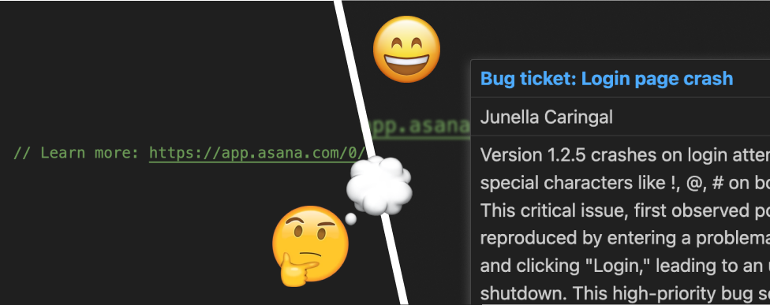

# Asana Task Tooltips

Tired of manually opening Asana links? You can now preview them on hover!

## Getting started

1. 🔑 Create a [Personal Access Token](https://app.asana.com/0/my-apps) in Asana
   - Look for the "Create new token" button
2. 💾 [Install this extension](https://marketplace.visualstudio.com/items?itemName=junellacaringal.asana-vscode-tooltip)
3. ✍ Enter your Personal Access Token when prompted
4. 🐭 Move your mouse over an Asana link
5. 👀 See tooltip
